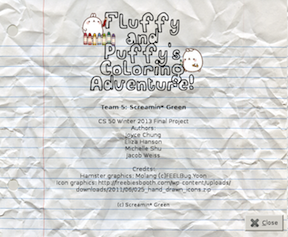
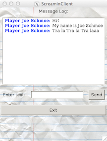
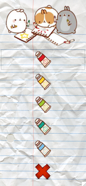
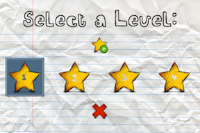
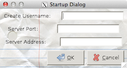
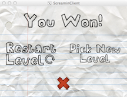

#GUI

####Back To [Overview](./Overview.html)

##Overview

The Graphical User Interface subsystem, or GUI, is the surface through which players can interact with the game. All of the mouse-events, option selections, and moves that a player makes is captured through the GUI, and sent to the appropriate subsystems that need that information. The linkage between the GUI and the other subsystems will be discussed later in this page.

The GUI subsystem consists of eight separate .c files:

1. MainWindow.c
2. GameView.c
3. AboutDialogWindow.c
4. ChatDialogWindow.c
5. ColorDialogWindow.c
6. LevelDialogWindow.c
7. StartupDialogWindow.c
8. WinDialogWindow.c

The .c files #3-8 each implement a dialog window that is a child of the top-level main window, which is created in .c file #1, MainWindow.c. Each of these subcomponents will be described in detail below.

###How The GUI Fits Together With Other Subsystems, and Important Inputs and Outputs

The GUI captures two important pieces of information: mouse events and text events. These two pieces of information allow our program to capture the following pieces of data from the user:

* Mouse Events
	* Toolbar button clicks (which in turn tells the GUI what dialog buttons to load)
	* Dialog window button clicks
		* The level that has been selected
		* The color that has been selected
	* Stroke-events, or mouse-down-and-drag-across-the-screen actions 
	  (which provides all of the necessary information needed to create shapes)
* Key Press Events ("Text" Events)
	* Username information
	* Server port information
	* Server address information
	* Chat messages
	
These pieces of information are all sent to the subsystems that require them. Mainly, the GUI sends information to the Client subsystem via the ClientPacketHandler (see [ClientPacketHandler](./ClientPacketHandler.html)). The Server subsystem then receives the following pieces of information through the Client Subsystem, and a full connection is established (Details on how that information is passed through is delineated in [Server](./Server.html) and [Client](./Client.html).) 

* Level Selection
* Color Selection
* Username
* Server Port
* Server Address
* Chat Messages

There are two additional "inputs" to the GUI that occur via the [ClientPacketHandler](./ClientPacketHandler.html). Two pieces of information are pulled from ClientPacketHandler's asynchronous queue via function calls, both from the Chat Dialog subcomponent of the GUI. The first is the username information needed to identify the sender of a chat message, and the second is the actual message. These two pieces of information are popped off of an asynchronous queue in the ClientPacketHandler when a function call is made to update the Chat Dialog's buffer. Chat Dialog will be discussed in further detail shortly, and more information about the asynchronous queue utilized in the ClientPacketHandler can be found in the [ClientPacketHandler](./ClientPacketHandler.html) section.

###Data Structures of the GUI

All of the information outlined in the section above are initially captured in the form of data structures in the GUI. The primary data structure is MainWindow, which is created in MainWindow.c. This structure contains the top-level main window, and every other widget that appears in the GUI is a child of that window. The members of this structure are:

1. window
2. game view
3. about dialog
4. chat dialog
5. color dialog
6. __color__
7. level dialog  
8. __level number__
9. startup dialog
10. __login username entry__
11. __server port entry__
12. __server address entry__
13. win dialog
	
As you can see, each dialog window that is created is a member of the MainWindow structure, and the pieces of information needed by other subsystems (as mentioned previously) are stored in this structure, as indicated in the bold above.

Other data structures in the GUI are Chat, GameView, and Status. These will be discussed in the .c files in which they are created and utilized (Chat Dialog, Game View, and Win Dialog, respectively).

####The Main Window
The Main Window is the main hub through which all of the information collected from dialog windows are stored and accessed (using the MainWindow data structure, as mentioned before).

####The Game View
The Game View .c file consists of a data structure that has as members the drawing area, a drawing color, and a stroke ID. For more information regarding strokes, please refer to [Stroke](./Stroke.html). It creates the drawing area, which is the main interface on which a player can draw their shapes via mouse-down events and subsequent mouse-drag actions. These actions are all defined in Game View, which also functions as a go-between for the GUI's drawing area and the [Graphics](./Graphics.html) subsystem. 

####About Dialog

The About Dialog displays our team information, as well as any credits and citations that we wished to provide.
To reiterate, our citations are as follows:

* Hamster graphics: Molang (c)FEELBug.Yoon
* Icon graphics: http://freebiesbooth.com/wp-content/uploads/downloads/2011/06/025_hand_drawn_icons.zip
* Crumpled Paper Background: http://naldzgraphics.net/textures/lined-paper-texture
* Text graphics: http://www.fonts2u.com/a-fat-child.font

####Chat Dialog

The Chat Dialog displays a window through which a player can view any messages being sent between players on the same server. Some features added to this dialog are that the username of each message is bolded and displayed in blue, messages typed can be sent using the carriage return key, to emulate the way people are used to messaging, and the chat window can be kept open, closed, and reopened at any time of the game without affecting the player's ability to access other parts of the game. This was an intended design decision, as the other dialog windows (except the Color Dialog) are set to "modal" so that the user has to respond to those dialogs before continuing on with the game.

The Chat Dialog .c file contains a Chat data structure that has as members the chat window's dialog view, a GtkTextBuffer for the chat view text editor (a scrollable widget embedded in the chat dialog), and a GtkTextIter, which keeps track of the end of the text buffer. This was necessary so that every single time a new chat message is popped off of [ClientPacketHandler](./ClientPacketHandler.html)'s asynchronous queue (as discussed previously), the chat view text editor's buffer can be updated properly. Of course, this requires knowledge of where the end of the buffer is, as well as what is already being stored in the buffer; this information is therefore stored in the Chat data structure.

####Color Dialog

The Color Dialog displays buttons that look like paint tubes, which players can select to change the color of their strokes at any point of the game. (Changing the color of a player's "ink" does not change the color of shapes that they previously made.) Like the Chat Dialog, a player can keep this window up and still interface with the drawing area and the rest of this game.

####Level Dialog

The Level Dialog displays star-shaped buttons that indicate a level number. This window allows players to select the level that they wish to play, and captures the level number so that the information can be sent through the ClientPacketHandler, to the Client, to the Server, and then back to the Client for the entire level loading process to occur. More information about this can be found in the [Server](./Server.html) subsystem, under [Level](./level.html).

####Startup Dialog

The Startup Dialog contains text entry widgets that allow a player to start our program by entering a username, server port, and server address. If a username is not entered, then a default "anonymous" is used, and will show up as the identifying username in the chat dialog. However, if a connection cannot be established using the server port and address provided by the player, then an error dialog pops up. A player cannot load any levels until a proper connection is successfully established to a server. Just like the level number information collected from the Level Dialog, the username, server port, and server address are all sent through the Client to the Server subsystems via the [ClientPacketHandler](./ClientPacketHandler.html).

####Win Dialog

The Win Dialog simply pops up when a level has been successfully completed (so when the target ball of a given level is dropped into the target basket), and says "you win!". There are also two options presented to the player in this dialog: restart level and select new level. Restarting a level will simply reset the current level completed, whereas clicking the "select new level" button will pull up the Level Dialog.

The Win Dialog .c file contains a Status data structure that has as its only member a status\_is\_win variable, which is updated to a 1 whenever the target ball is dropped into the target basket of a level. This allows the current status of the game to be checked with every step of the GUI time handler so that as soon as the level has been completed, the Win Dialog can pop up at the right time. Of course, once the Win Dialog window does pop up, the status\_is\_win variable is reset to 0.

###Public Functions
The public functions in the GUI are primarily the _create_ and _run_ functions associated with each dialog. These functions are made public so that they can be called in MainWindow.c. Of course, the _create_ functions are called in MainWindow.c along with the allocation of space for and initialization of the top-level window that is in the MainWindow data structure, while the _run_ functions are called via GTK callback functions for toolbar button press events.

GameView.c and MainWindow.c also provide some public functions. GameView.c has public functions for the initialization and allocation of the drawing area that MainWindow must access. MainWindow.c has a public function that allows [ClientMain](./ClientMain.html) to call its own creation at the start of the program. There is also a public function that ClientMain can access from MainWindow.c that allows ClientMain to start the running of the GTK main loop, which ends in the destruction of the MainWindow structure, the top-level window, and all of its children when a player decides to exit the program.

There are two subcomponents of the GUI that also provide public functions that must be accessed by the [ClientPacketHandler](./ClientPacketHandler.html), so that the ClientPacketHandler can add username, server port, server address, level number, and chat message data to its queue in order to send that information along to the Client and Server. Those two subcomponents are the Chat Dialog and the Startup Dialog. This is discussed in further detail in the [ClientPacketHandler](./ClientPacketHandler.html) section.

###Private Functions
The rest of the functions in the GUI are private, and can only be accessed within the .c file. These private functions are primarily callback functions associated within each dialog, which means there is never a need for another .c file to have access to these functions. For example, button\_click callback functions for each dialog can be used to show and hide the dialog window, as shown below:

static void	button\_new\_level\_click(GtkWidget\* widget,	MainWindow\* main_window)
{
	gtk\_widget\_hide(main\_window->win\_dialog);
	level\_dialog\_run(NULL, main_window);
}

static void button\_cancel\_click(GtkWidget\* widget, MainWindow\* main_window)
{
	gtk\_widget\_hide(main_window->win\_dialog);
}

This example was pulled from WinDialogWindow.c, and shows how button click events can be used to show and hide a dialog window. It is of note that each dialog window is simply shown/hidden, not created/destroyed after an initial creation, so that every single time a player decides to click on a toolbar item a new GTK widget and dialog does not have to be made. At the end of the program, of course, all of these dialogs and widgets are destroyed when the top-level GTK window is destroyed via a callback function associated with an EXIT toolbar button.

Overall, the GUI is structured in this modular fashion such that each dialog window has its own .c file with only the functions that the dialog needs to function properly. This design allowed for dialog windows to be created and tested for functionality manually and individually, and accounts for the difficult nature of trying to run _valgrind_ and _gdb_ analyses on GTK functions. Finally, creating individual .c files and making only the functions that needed to be accessed by MainWindow.c and ClientPacketHandler.c public allowed for organization and clarity of code, as the numerous functions and declaring of GTK widgets under one ___long___ GUI.c file would become unmanageable and unscalable as features are added.