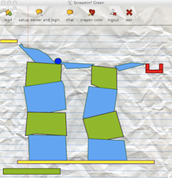
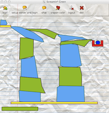

#Game

####Back To [Overview](./Overview.html)
	
##Overview
Fluffy and Puffy's Coloring Adventure is both a single player and multiplayer game that involves free-hand drawing, physics, and strategic collaboration amongst players. The objective of the game is to get a ball into a basket, in any given level. This is achieved by players drawing shapes, which then behave as real-word objects would (as they follow the laws of physics), and fall down the window until they reach an obstacle. Thus, these shapes can be utilized to create bridges and surfaces through which the target ball of a level can be guided towards the basket. The ball, of course, can be put into motion by dropping a shape on top of it and causing it to roll. As levels grow in difficulty, careful planning and coordination between players becomes the key to solving the puzzle, as some become impossible to solve in a single player mode. 

You can see from Figure 1 (a screen capture of a failed attempt at Level 4) how challenging a level can become. In this case, the ball got stuck in a crevice as it rolled down the left-most "ramp" created by a player. A successful completion of Level 4 is also shown below, in Figure 2. The "ink" meter can also be seen in these two figures below, on the bottom-left corner of the game windows.

###The Rules
The rules of our game are as follows, and applies to both the single player and multiplayer modes:

1. Every player is limited to a given amount of drawing material ("ink"). This means that shapes larger than a certain size will not be accepted as legitimate. The player can see how much drawing 	material they use in any given stroke via an "ink" meter that appears at the bottom-left corner of the drawing area. 

2. If any shape that a player successfully creates comes into contact with another one of their own shapes, those two shapes will disappear. This means that players must carefully plan out a strategy such that they never hit their own shapes.

3. Players are limited to the physical confines of the drawing area window, and any shapes that fall out of this boundary disappear from the game forever.

4. When a player's shape hits another player's shape, the shapes will interact via the laws of physics.

5. Once the target ball lands within a basket, the level is completed.

##Game Features

###Level Selection

Players can select a single level to play together, or on their own. This is done through a level selection window, which is discussed in further detail in the [Graphical User Interface](./GUI.html) section. Currently, our game has four levels, which increase in difficulty. 

###Chatting
Players can communicate with each other via chat. Please refer to [Chat Dialog in the GUI](./GUI.html) for more details. Very briefly, a message is identified with a username provided by a player when they initially log into the server. Thus, players can identify who they are playing with, who is saying what.

###Color Selection

Players can change the color of their "ink" during any point of the game. The change in color can be easily verified through the "ink" meter that appears at the bottom-left corner of the game. Please refer to [Color Selector in the GUI](./GUI.html) for more details on the interface for this feature.

##Game Design Decisions

Our team chose to implement the identified features above, as they were outlined as milestones for this project. However, we also chose to add graphical features such as icons, a paper-like background, and bunny-like creatures to add to the aesthetics of the interface and create a more game-like feeling. More importantly, our team focused on the unique, differentiating aspects of our game, which can be most easily identified through the set of rules delineated above. 

Some of these unique game designs are:

* The free-hand drawings that players create, which were turned into robust shapes that interact with each other in a pseudo-realistic fashion.
* Setting limitations on the amount of "ink" utilized and the feature of showing that "ink" meter, which allows our game to become more challenging.
* The rule that collisions between a given player's shapes causes them to disappear, which also creates a level of sophistication in the difficulty of successfully completing a level and forces collaboration between players. 

Our team's goal was to create an interesting and challenging game that emphasizes and showcases interactions between players, their shapes, and their abilities to coordinate with one other. The single player mode is interesting, but limited, while the multiplayer mode is intriguing in the endless challenges that can be devised through levels of varying difficulty. We are excited to present Fluffy and Puffy's Coloring Adventure as our final project for CS50, and hope that you find it just as enjoyable and entertaining as we did.