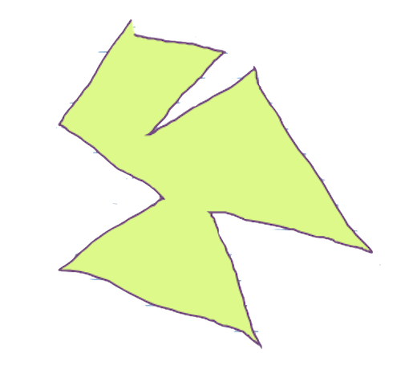
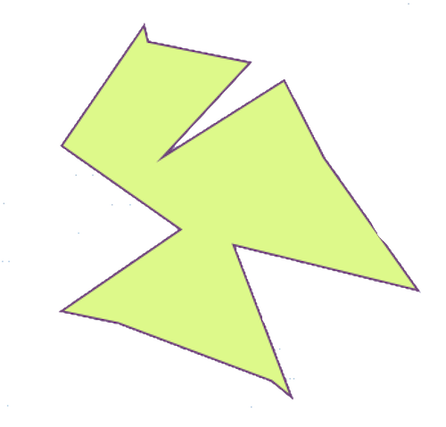
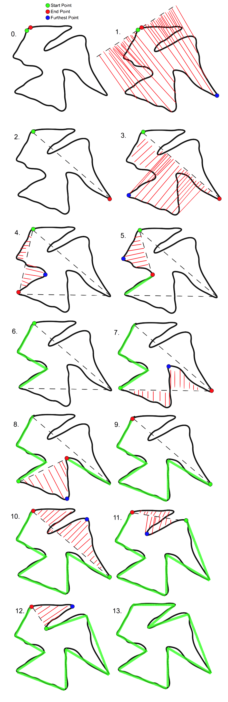

#Stroke

<table>
<tr>
<td style="vertical-align: top;">

####Back To [Overview](./Overview.html)

##Overview

Strokes contain all the information required for [graphics](./Graphics.html) to draw. 

##Uses

Strokes are used in many places throughout the code. Both the [World](./World.html) and [ClientWorld](./ClientWorld.html) maintain GHashTables of Strokes. [Graphics](./Graphics.html) loops through the client-side hash table and draws all the strokes which it contains. Although both the [ClientPacketHandler](./ClientPacketHandler.html) and [ServerPacketHandler](./ServerPacketHandler.html) deal with packets pertaining to Strokes, they don't manipulate them in any significant way.

##Structure

Along with all the required drawing information; such as color, width, and fill; the Stroke structure also contains properties that represent position and rotation. 

Each Stroke has an x coordinate, y coordinate, and theta. Every point added to a stroke is added relative to the current x, y coordinates of the Stroke. 

Stroke\_get\_positionand stroke\_get\_rotation do not access these variables directly. Instead, there exists one level of indirection. The Stroke structure also contains three pointers to doubles, body\_x, body\_y, and body\_theta. Upon initialization, these point to the x, y, and theta properties within the Stroke. Using the functions, stroke\_set\_body\_position and stroke\_set\_body\_rotation, these pointers can be made to point to any value. Specifically, this is useful because these values can be set to point to the x, y, and rotation values of a cpBody. This keeps the position of the Stroke and its cooresponding cpBody in sync.

##Polygon Detection Algorithm

One awesome feature of a Stroke is that it can approximate itself as a polygon. I do not claim to be the first to invent this algorithm, but I did come up with it on my own. Its implementation can be found in Stroke.c within the function stroke\_analyze\_shape\_in\_range. 

This recursive function takes two points as parameters. Initially, stroke\_analyze\_shape\_in\_range is called from the function stroke\_analyze\_shape with the first and last point of the stroke as parameters.

In step 1, a line is created connecting the two input points. Then, we loop through the points on the stroke in between the two input points. We then calculate the distance between each point on the stroke and the line. During this process, the point farthest from the line is remembered. The root-mean-square average of these distances is then taken. 

If this average is below a set threashold (#defined as RMS\_MIN), then we know that the two input points are vertices of the polygon.

If this average is above the set threshold, then the function recurses twice: from the first input point to the farthest point, and then from the farthest point to the second input point.

Note: By adjusting the threshold (RMS\_MIN), one can adjust the algorithm's pickyness. A smaller value of RMS\_MIN will cause the algorithm to require a closer match between the approximation line and the Stroke. A larger value will allow for greater approximations to be made.

Now, let's talk about run time. Each recurse, the algorithm must do three things. First, it must find the root-mean-square average, a linear time operation. Second, it must find the farthest point (which it actually does at the same time that it takes the root-mean-square average), which is also a linear time operation. Third, it must merge the arrays of vertices returned from deeper recursive calls. This is also performed in linear time. Therefore, all operations done during the reucurse are linearly dependent on the number of points being operated on.

In the best case, each recurse splits the stroke into two equal pieces. Another way of saying this is that the farthest point is also the midpoint. In this case, the algorithm runs like merge sort, O(nlogn). However, the base case of this algorithm is not a single point, but a single side. Therefore, the algorithm runs more like O(nlogm), where m is the number of sides of the analyzed polygon.

Theoretically, the worst case would be that the farthest point is always the point directly adjacent to the first or last input point. Although this case is extremely unlikely (and may be impossible), it should be noted that the run time would be O(n^2).

Running this algorithm on Strokes has several major benefits and very few costs. First, by removing the majority of points from a Stroke, [Chipmunk](http://www.chipmunk-physics.net/) has fewer shapes to simulate in its space, and is able to run faster. [Graphics](./Graphics.html) also has an easier time as it has to draw fewer line segments per polygon. 

From a user perspective, when you try to draw a box, you get something that looks quite box-like instead of a misshapen-boxish-blob-thing. As a side affect, this makes it easier to stack polygons on top of one another, which is integral to our [game](./Game.html).

##Circle Detection Algorithm

The algorithm used to detect circles is, in many ways, similar to the polygon algorithm. However, it is much simpler. First, the bounding box of the Stroke is calculated. We then find the center of the bounding box. For a perfectly drawn circle, the center of the circle and the center of the circle's bounding box should be one in the same. Then, we take the average of the bounding box's width and height. This is taken to be two times the ideal radius of the circle. Next, we iterate over all the points on the stroke and take distance between each point and the calculated center. Then we take the difference between this distance and the ideal radius. Finally, we take the root-mean-square average of all of these differences. If the rms divided by the ideal radius is below a certain value (#defined CIRCLE\_RMS), then the stroke is taken to be a circle with the calculated center and radius.

This algorithm has to run over the entire Stroke two times: once for the bounding box, and once for the rms. Therefore, it runs in O(n) time. For this reason, it runs before the polygon algorithm. If the Stroke is determined to be a circle, then the polygon algorithm does not run.

##Why not use cpShape?

cpShapes were not used on the [client](./Client.html) side for two reasons.

First, because [Chipmunk](http://www.chipmunk-physics.net/) cannot simulate concave polygons, we must triangulate them. This means that every cpBody contains many cpShapes (one for each triangle). In order to draw a cpBody, one must have a representation of the outline of the cpBody to be drawn. Since the body contains many cpShapes, it would be very difficult to differentiate between the internal edges of a triangulated polygon and the external edges. Therefore, it makes sense to have a data structure that only represents the outside edges.

Second, it makes sense from a design perspective to isolate the [Chipmunk](http://www.chipmunk-physics.net/) library from the client side. Because physics simulation does not happen client-side, it doesn't make sense to force the client to have a working copy of the [Chipmunk](http://www.chipmunk-physics.net/) library. 

 

</td>
<td style="vertical-align: top;">

</td>
</tr>
</table>

